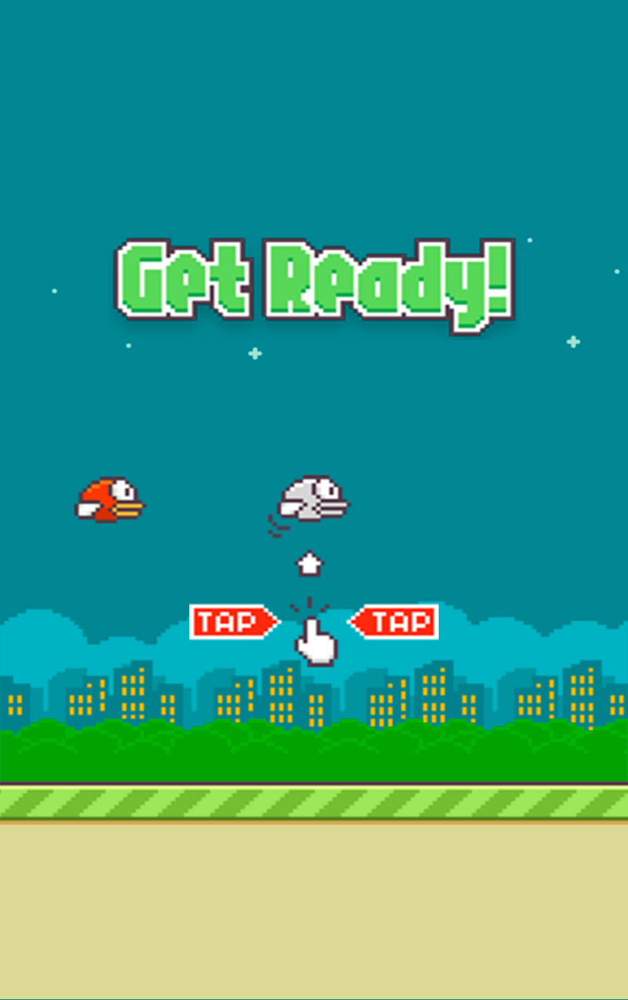

# Games
Мой финальный проект по сетевым технологиям за пятый семестр. Я пытался сделать проект об играх. 
1. Войдите в интерфейс и нажмите Flappy-bird
2. Нажмите, чтобы начать игру.Щелчок мышью птичка прыгает.
3. Когда птица попадает в столб или приземляется, игра окончена.
- [flappy-bird](https://rrdawlx.github.io/Games/flappy-bird)  
  
- 